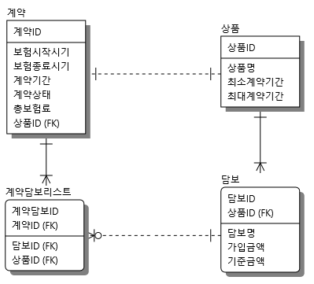
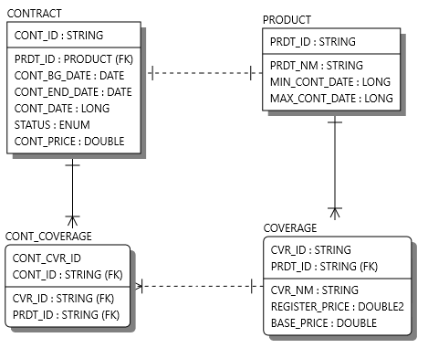

# 20220804-kms

# 사전과제2 - 계약관리 시스템

## 개발환경
- SpringBoot, JPA, H2 Database, Gradle, Junit4

## start.spring.io 에서 프로젝트 생성
- project : Gradle Project
- Language : Java
- Spring Boot : 2.7.2 version
- Packaging : Jar
- Java : 11
- Dependencies : SpringWeb, Spring Data JPA, H2 Database, Lombok, Validation

## 테이블 설계 (v2)





## 실행방법
- GIT, JAVA, H2 database, Postman은 설치되어 있다고 가정한다. 
- API Test는 Postman을 통해 하며 Header에 ContentType은 application/json으로 설정한다
```
$ H2 DataBase 실행시
url: jdbc:h2:tcp://localhost/~/insurance  
username: sa  
password:  
driver-class-name: org.h2.Driver  
```
```
$ git clone https://github.com/kakao-insurance-quiz/20220804-kms.git
$ cd 20220804-kms
$ ./gradlew clean build
$ java -jar build/libs/management-0.0.1-SNAPSHOT.jar
```

- 접속 Base URI: `http://localhost:8080`
- Swagger API spec `http://localhost:8080/swagger-ui/`


### 0. 과제의 요건에 대한 고민 및 접근 / 해결 방식
##### - 쿼리가 아닌 도메인에 종속된 개발을 위해 Mybatis가 아닌 Spring Data JPA를 사용하였다
##### - 테이블의 경우 script.sql을 통해 미리 생성하며며 상품과 담보의 경우 data.sql을 통해 미리 insert하였다. (ddl-auto 기능은 위험할수 있으므로 사용하지 않고 직접 생성)
##### - 상품ID의 경우 1000 부터 생성할때마다 차례대로 증가, 담보ID의 경우 0부터 차례대로 증가 ,계약ID의 경우 202200000 부터 1씩 증가 (sequential 활용)
##### - 특정 계약애서 한 상품만을 선택할수 있으므로 계약과 상품은 단순히 1대1 관계로 매핑하였다
##### - 특정 계약에서 한 상품을 고르고 담보의 경우 여러개를 선택할수 있으므로 다대다 관계가 될수 있으므로 다대다 관계를 일대다 2개로 해소하기 위해 특정계약에 속한 담보들의 리스트를 따로 테이블로 관리하였다 
##### - Test의 경우 service 단을 @SpringBootTest를 통해 16가지의 케이스의 통합테스트로 구현하였다
##### - API를 FrontEnd에서 사용할것을 고려하여 CommonResponse와 CommonException 정의하였다
##### - Entity를 직접 Response로 보내지 않고 ResponseDto를 따로 정의하여 Controller 단에서 mapping 해주었다. 
##### - Request시 반드시 필요한 값인 경우 @NotNull, @NotBlank, @Valid를 통해 검증하였다
##### - Request의 경우도 Body를 받는경우 RequestDto를 정의하여 Controller에서 매개변수에서 자동 mapping 되는 기능을 활용 하였다
##### - Service에서 @Transactional을 통해 transaction 처리를 해주었으며 조회해오는 기능만 포함된 경우 성능을 고려하여 readOnly = true 설정을 추가하였다
##### - (확장) 피보험자나 계약자 같은 경우 문제에서 명세 된것 처럼 고려하지 않았으나 만약 고려 할경우 계약관계자리스트, 관계자, 관계자를 상속받은 피보험자, 계약자 등의 Entity를 추가하는 방식으로 확장 가능하다
##### - (확장) 계약, 상품, 담보 ID의 경우 sequential로 되어있지만 채번이 필요한경우 채번하는 로직을 개발하여 생성시에 할당해주는것도 가능하다

## 기능 


### 1. 상품 전체 조회 

URI: `(GET) http://localhost:8080/product/list`
##### - 초기 생성된 데이터 기준이며 전체 상품리스트와 그 상품의 정보와 담보정보 들을 보여준다
```
Response:
[
    {
        "prdtId": 1000,
        "prdtNm": "여행자보험",
        "minContDate": 1,
        "maxContDate": 3,
        "cvrData": [
            {
                "cvrId": 0,
                "cvrNm": "상해치료비",
                "registerPrice": 1000000.0,
                "basePrice": 100.0
            },
            {
                "cvrId": 1,
                "cvrNm": "항공기 지연도착시 보상금",
                "registerPrice": 500000.0,
                "basePrice": 100.0
            }
        ]
    },
    {
        "prdtId": 1001,
        "prdtNm": "휴대폰 보험",
        "minContDate": 1,
        "maxContDate": 12,
        "cvrData": [
            {
                "cvrId": 2,
                "cvrNm": "부분손실",
                "registerPrice": 750000.0,
                "basePrice": 38.0
            },
            {
                "cvrId": 3,
                "cvrNm": "전체손실",
                "registerPrice": 1570000.0,
                "basePrice": 40.0
            }
        ]
    },
    .... 이하생략
    }
]
```
### 2. 상품 정보(단건) 조회

URI: `(GET) http://localhost:8080/product/{prdtId} (상품ID)`  
##### - URL에 상품ID(prdtId)를 넣고 호출한다
##### - 해당 단건 계약, 상품, 담보 정보가 출력 (1001로 넣고 출력한 결과)
```
Response : 
{
    "prdtId": 1001,
    "prdtNm": "휴대폰 보험",
    "minContDate": 1,
    "maxContDate": 12,
    "cvrData": [
        {
            "cvrId": 2,
            "cvrNm": "부분손실",
            "registerPrice": 750000.0,
            "basePrice": 38.0
        },
        {
            "cvrId": 3,
            "cvrNm": "전체손실",
            "registerPrice": 1570000.0,
            "basePrice": 40.0
        }
    ]
}
```
### 3. 계약 생성 API - 상품ID, 담보ID, 계약기간을 통해 새로운 계약을 생성한다

URI: `(POST) http://localhost:8080/contract/create`
##### - 미리 생성된 상품ID(prdtId) 1001과 담보ID(cvrIds) [0,1] 계약기간(contDate) 1로 넣고 호출
##### - 보험료 계산의 경우 service에 책임을 넘기지 않기위해 Contract 도메인에서 계약 생성시 계산하였다.  
```
Request : 
{
    "prdtId" : 1000,
    "cvrIds" : [0,1],
    "contDate" : 1
}
```
##### 계약생성이 완료되며 DB에 계약정보가 저장된다
##### 생성된 계약ID(contId)가 SUCCESS 되었다는 CommonResponse와 함께 출력
```
Response : 
{
    "status": "OK",
    "message": "SUCCESS",
    "code": 200,
    "data": {
        "contId": 202200000
    }
}
```
### 4. 계약(단건)정보 조회 - 계약 ID를 통해 계약 정보를 받아온다

URI: `(GET) http://localhost:8080/contract/{contId}`
##### URL에 계약ID(contId)를 넣고 호출한다
##### 해당 단건 계약, 상품, 담보 정보가 출력 (계약ID 202200000으로 설정)
```
Response : 
{
    "contId": 202200000,
    "contractStatus": "NORMAL",
    "contBgDate": "2022-08-11T19:23:02.520659",
    "contEndDate": "2022-09-11T19:23:02.520659",
    "contDate": 1,
    "contPrice": 15000.0,
    "product": {
        "prdtId": 1000,
        "prdtNm": "여행자보험",
        "minContDate": 1,
        "maxContDate": 3,
        "cvrData": [
            {
                "cvrId": 0,
                "cvrNm": "상해치료비",
                "registerPrice": 1000000.0,
                "basePrice": 100.0
            },
            {
                "cvrId": 1,
                "cvrNm": "항공기 지연도착시 보상금",
                "registerPrice": 500000.0,
                "basePrice": 100.0
            }
        ]
    }
}
```
### 5. 계약 전체 조회 - 모든 계약 정보를 받아온다
##### 모든 계약의 상품, 담보 정보가 출력 - 처음 data.sql을 통해 4개의 상품이 등록되어 있음
URI: `(GET) http://localhost:8080/contract/list`

```
Response : 
[
    {
        "contId": 202200000,
        "contractStatus": "NORMAL",
        "contBgDate": "2022-08-11T19:23:02.520659",
        "contEndDate": "2022-09-11T19:23:02.520659",
        "contDate": 1,
        "contPrice": 15000.0,
        "product": {
            "prdtId": 1000,
            "prdtNm": "여행자보험",
            "minContDate": 1,
            "maxContDate": 3,
            "cvrData": [
                {
                    "cvrId": 0,
                    "cvrNm": "상해치료비",
                    "registerPrice": 1000000.0,
                    "basePrice": 100.0
                },
                {
                    "cvrId": 1,
                    "cvrNm": "항공기 지연도착시 보상금",
                    "registerPrice": 500000.0,
                    "basePrice": 100.0
                }
            ]
        }
    },
    {
        "contId": 202200001,
        "contractStatus": "NORMAL",
        "contBgDate": "2022-08-11T19:33:51.730354",
        "contEndDate": "2022-11-11T19:33:51.730354",
        "contDate": 3,
        "contPrice": 176960.52,
        "product": {
            "prdtId": 1001,
            "prdtNm": "휴대폰 보험",
            "minContDate": 1,
            "maxContDate": 12,
            "cvrData": [
                {
                    "cvrId": 2,
                    "cvrNm": "부분손실",
                    "registerPrice": 750000.0,
                    "basePrice": 38.0
                },
                {
                    "cvrId": 3,
                    "cvrNm": "전체손실",
                    "registerPrice": 1570000.0,
                    "basePrice": 40.0
                }
            ]
        }
    }
]
```

### 6. 계약 정보 수정 API - 계약의 담보 삭제/추가, 계약기간변경, 계약상태변경

#### 6-1. 계약의 담보 삭제

URI: `(POST) http://localhost:8080/contract/coverage/delete`
##### 위에서 생성한 계약ID(contId) 202200000과 담보ID(cvrId) 1 을 넣고 호출
```
Request : 
{
    "contId" : 202200000,
    "cvrId" : 1
}
```
##### DB에서 해당 계약의 담보가 삭제되며
#####생성된 계약ID(contId)가 SUCCESS 되었다는 CommonResponse와 함께  출력
```
Response : 
{
    "status": "OK",
    "message": "SUCCESS",
    "code": 200,
    "data": {
        "contId": 202200000
    }
}
```
  

#### 6-2. 계약의 담보 추가

URI: `(POST) http://localhost:8080/contract/coverage/add`
##### 위에서 생성한 계약ID(contId) 202200000과 삭제했던 담보ID(cvrId) 1 을 넣고 호출
```
Request : 
{
    "contId" : 202200000,
    "cvrId" : 1
}
```
##### DB에서 해당 계약에 담보가 추가되며 보험료가 다시 계산된다
##### 생성된 계약ID(contId)가 SUCCESS 되었다는 CommonResponse와 함께 출력
```
Response : 
{
    "status": "OK",
    "message": "SUCCESS",
    "code": 200,
    "data": {
        "contId": 202200000
    }
}
```

#### 6-3. 계약기간 변경

URI: `(POST) http://localhost:8080/contract/update/date`
##### 위에서 생성한 계약ID(contId) 202200000과 계약기간(contDate) 2 을 넣고 호출
```
Request : 
{
    "contId" : 202200000,
    "contDate" : 2
}
```
##### DB에서 해당 계약의 계약기간이 변경되며 보험료가 다시 계산된다.
##### 생성된 계약ID(contId)가 SUCCESS 되었다는 CommonResponse와 함께 출력
```
Response : 
{
    "status": "OK",
    "message": "SUCCESS",
    "code": 200,
    "data": {
        "contId": 202200000
    }
}
```

#### 6-4. 계약상태 변경

URI: `(POST) http://localhost:8080/contract/update/status`
##### 위에서 생성한 계약ID(contId) 202200000과 계약기간(contStatus) EXPIRE 을 넣고 호출
```
Request : 
{
    "contId" : 202200000,
    "contStatus" : "EXPIRE"
}
```
##### DB에서 해당 계약의 계약상태가 변경된다.
##### 변경된 계약ID(contId)가 SUCCESS 되었다는 CommonResponse와 함께 출력
```
Response : 
{
    "status": "OK",
    "message": "SUCCESS",
    "code": 200,
    "data": {
        "contId": 202200000
    }
}
```

### 7. 예상 총보험료 계산

URI: `(POST) http://localhost:8080/contract/calculate`
##### 상품ID(prdtId)와 해당 상품의 담보들의 ID(cvrIds), 계약 기간을 넣고 호출
```
Request : 
{
    "prdtId" : 1001,
    "cvrIds" : [2,3],
    "contDate" : 5
}
```
##### 계산된 보험료(contPrice)가 소숫점 3자리에서 절삭되어 SUCCESS 되었다는 CommonResponse와 함께 출력
```
Response : 
{
    "status": "OK",
    "message": "SUCCESS",
    "code": 200,
    "data": {
        "contPrice": 294934.21
    }
}
```
### 8. 상품(+담보) 생성 API

URI: `(POST) http://localhost:8080/product/create`
##### 상품의 이름, 최소계약기간, 최대계약기간, 
##### 담보들의 담보명, 가입금액, 기준금액 을 넣고 호출
##### 담보의 경우 상품에 종속되어 있기 때문에 상품을 생성할때 함께 생성하는 방식을 채택 
```
Request : 
{
    "prdtNm" : "생성한 첫 상품",
    "minContDate" : 1,
    "maxContDate" : 5,
    "coverages" : [
        {
            "cvrNm": "1번담보",
            "registerPrice" :6000000,
            "basePrice" : 1000
        },
        {
            "cvrNm": "2번담보",
            "registerPrice" :30000000,
            "basePrice" : 1000
        },
        {
            "cvrNm": "3번담보",
            "registerPrice" :40000000,
            "basePrice" : 1000
        }
    ]
}
```
##### 상품생성이 완료되며 DB에 상품과 담보 정보들이 저장된다
##### 생성된 상품ID(prdtId)가 SUCCESS 되었다는 CommonResponse와 함께 출력
```
Response : 
{
    "status": "OK",
    "message": "SUCCESS",
    "code": 200,
    "data": {
        "prdtId": 1004,
        "cvrData": []
    }
}
```
### 9. 이미 존재하는 상품에 담보를 추가 생성하는 API 

URI: `(POST) http://localhost:8080/product/create`
##### 상품ID(prdtId), 추가할 담보명(cvrNm), 가입금액(registerPrice), 기준금액(basePrice)
##### 담보들의 담보명, 가입금액, 기준금액 을 넣고 호출
##### 담보의 경우 상품에 종속되어 있기 때문에 상품을 생성할때 함께 생성하는 방식을 채택
```
Request : 
{
    "prdtId" : 1000,
    "cvrNm" : "추가할담보명",
    "registerPrice" : 8000000,
    "basePrice" :100
}
```
##### 1000번 상품에 담보생성이 완료되며 DB에 추가된 담보 정보들이 저장된다
##### 담보가 추가된 상품ID(prdtId)가 SUCCESS 되었다는 CommonResponse와 함께 출력
```
Response : 
{
    "status": "OK",
    "message": "SUCCESS",
    "code": 200,
    "data": {
        "prdtId": 1000,
        "cvrData": []
    }
}
```

### 10. 안내장 발송기능 ( 테스트의 용이함을 위해 1주일 말고 3개월로 구현하였음)
##### @Scheduled 를 활용하여 30초에 한번씩 계약기간이 3개월 이하 남은 계약리스트를 불러와서 log.info를 찍어 주는 방식  
##### ( 테스트의 용이함을 위해 1주일 말고 3개월로 설정하였으니 쿼리를 조금 수정하면 1주일 전으로 변경가능)  
##### 현재 찍히는 로그: `계약번호 202200000 계약이 만기 도래 되었습니다. 만기일은 2022-09-11 입니다.`   
##### 현재 설정된 
##### @Scheduled(cron = "*/30 * * * * *") 
##### -> @Scheduled(cron = "0 0 11 * * *") 
##### 로 바꿔준다면 매일 11시에 안내장을 발송하는 식으로 변경 가능

### 11. 공통 exception 목록
##### 해당 exetpion 발생시  throw new CommonErrorException(ErrorCode.WRONG_CONTRACT) 와 같은식으로 호출
##### exception의 목록은 ErrorCode 라는 enum class에서 관리된다.
```
Exception 목록

410(REQUIRED_PARAMETER_ERROR) : Request 호출시 @NotNull 설정된 parameter을 포함하지 않고 호출시

- 계약 관련 ErrorCode
411(WRONG_CONTRACT) : 계약ID 값을 잘못보내거나 하는 등의 오류로 계약이 존재하지 않을경우 
412(EXPIRED_CONTRACT) : 만료된 계약의 변경업무를 수행하려 할경우 
413(WRONG_CONTRACT_COVERAGE) : 특정 계약의 담보를 삭제하거나 할때 계약에 존재하지 않는 담보일 경우
414(WRONG_CONTRACT_DATE) : 계약기간 설정시 상품에 설정된 최소 계약기간보다 낮거나 최대 계약기간보다 높을 경우

- 상품 관련 ErrorCode
415(WRONG_PRODUCT_COVERAGE) : 이미 존재하는 계약에 담보를 추가하거나 할때 계약한 상품에 포함되지 않은 담보일경우
416(WRONG_PRODUCT) : 상품ID 값을 잘못보내거나 하는 등의 오류로 상품이 존재하지 않을경우 


- 담보 관련 ErrorCode
417(WRONG_COVERAGE) : 담보ID 값을 잘못보내거나 하는 등의 오류로 담보가 존재하지 않을경우 
```